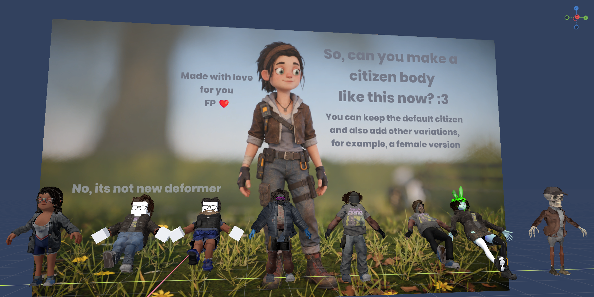
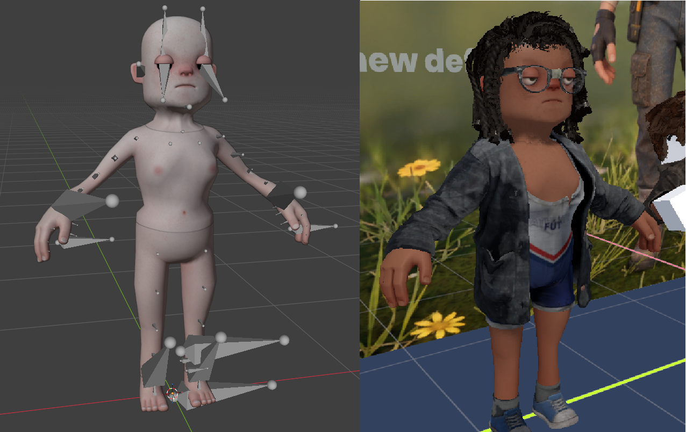

# Citizen Autofit

Refits s&box citizen clothing to a body it was not made for, at the moment it is put on.



All citizen clothing is modelled on the stock citizen (or one of the two stock humans). Change the
body, or use another player model on the same skeleton, and the clothing clips through it or
floats off it. This project takes the clothing that already exists and moves it to sit on the new
body the way it sat on the old one. No per-garment work, no deformer volumes, nothing baked ahead
of time.

It is a regular game project: no whitelist exceptions, not standalone-only.



Left: the citizen reshaped in Blender. Right: the same body in s&box with stock clothing on,
fitted when it was put on.

## Using it

1. Add a **Fit Dresser** component to an object and point **Body Target** at the body's
   `SkinnedModelRenderer`.
2. Fill in **Clothing**, or tick **Use Local Avatar**, or press **Randomize**.
3. That's it. The dresser applies on start; the buttons below do the same by hand.

| Property | What it does |
|---|---|
| Body Target | The body to dress. |
| Use Local Avatar | Wear what the local player's avatar wears instead of the list. |
| Clothing | The outfit, same entries as the stock Dresser. |
| Fit At Runtime | Off: clothing is worn as is, for comparison. |
| Version | Which version of each garment to wear: Auto, Citizen, Human Male, Human Female. Auto goes by the skeleton. It tells a citizen from a human well, but not a male human from a female one, so set it by hand when it guesses wrong. |
| Height | How tall the character is, 0 to 1, same as the stock Dresser. Scales the body through its animation graph; the clothing follows. |
| Apply On Start | Dress when the component starts. |

Buttons: **Apply Clothing**, **Clear Clothing**, **Randomize** (same groups and odds as the stock
Dresser), **Refit Clothing** (forget everything fitted so far and dress again; use it after
re-exporting the body model).

Console commands:

- `fitdresser_refit` - Refit Clothing on every dresser in the scene.
- `clothingfitter_test <body.vmdl> <garment.vmdl> [citizen|male|female]` - fit one garment to one
  body from a cold start and print how long it took. Touches no scene.
- `clothingfitter_info <body.vmdl>` - what the fitter sees in a body model: size, closest stock
  skeleton, bones in common with each.

From code, without the component:

```csharp
string garmentPath = "models/citizen_clothes/jacket/biker_jacket/models/biker_jacket.vmdl";
Model fitted = await ClothingFitter.FitAsync( body.Model, garmentPath, ClothingFitter.BodyKind.Citizen );

var renderer = clothingObject.Components.Create<SkinnedModelRenderer>();
renderer.Model = fitted ?? Model.Load( garmentPath );   // null means "wear it as is"
renderer.BoneMergeTarget = body;
```

`FitAsync` also takes a callback, `onRough`. A garment's LODs are fitted roughest first, and the
callback gets a model made of the ones fitted so far each time another is ready, so there is
something to wear after a few dozen milliseconds. The dresser uses it.

The last argument says which stock body that garment model was made for.
`ClothingFitter.KindOfAsync( body.Model )` tells which one a body is closest to, to pick between
a garment's citizen and human models. Call both from the main thread.

`scenes/dresser_models.scene` has an edited citizen, a citizen built out of boxes and a few
workshop player models, each with a Fit Dresser.

## What it handles

- **An edited citizen.** Thicker body, bigger arms, a chest, a different head or neck. As long as
  the UV layout is the stock one, the match between the old skin and the new is exact.
- **Any other model with the citizen's bone names.** No shared UVs needed, the match is found by
  casting rays out from the bones.
- **A different rest pose and different proportions.** A model that is taller, has longer legs or
  even faces another way in its bind pose is brought into the stock pose bone by bone first, and
  the fitted garment is scaled back per bone afterwards.
- **Bodies made of separate overlapping pieces** (the box citizen here is 17 boxes). Only the
  surface that can be seen from outside counts.
- **Citizen and human clothing.** A model on the human skeleton gets the human version of each
  garment where there is one, fitted against the matching stock human.
- **Rigid things stay rigid.** A piece whose vertices all share the same skin weights can't bend
  in animation, so it is moved as a whole: rotated and shifted, scaled only if it wraps the body.
  Glasses keep their lenses in the frame, a sword on a strap doesn't bend with the neck.
- **Hair made of cards.** Each card follows the scalp on its own.
- **Normals.** Each normal is turned the same way the surface around its vertex turned, so
  shading stays right where a garment bends around a new shape, and hard edges and smoothing stay
  as the artist made them. Tangents are rebuilt from the UVs.
- **LODs.** Every LOD of a garment is fitted and the fitted model switches between them at the
  garment's own distances.
- **Any compiled clothing model that is mounted**, including models with several meshes and
  materials and with compressed vertex and index buffers. The fitter reads `.vmdl_c` files
  itself, because the engine doesn't hand out skin weights.

## What it doesn't

- A garment's material groups and morphs are not carried over to the fitted model.
- Clothing follows bones by name. A model that shares fewer than half of the bones gets a
  warning in the log and clothing won't sit on it properly.
- Each garment is fitted to the body on its own. Two layers don't know about each other, so on a
  body with hard edges a shirt can show through a jacket in places.
- The dresser doesn't apply avatar age or skin tint, and doesn't network anything: every client
  dresses the character itself from the same list.
- A model built at runtime has no per-bone bounds, so the engine culls bone-merged clothing by a
  box around its bone positions, which is far too small. The dresser overrides the clothing's
  bounds with the body's every frame. If you use `ClothingFitter` without the dresser, do the
  same.

## How long it takes

Nothing stalls. All the work is done on worker threads, cut into steps that run side by side;
the main thread only creates the meshes and the model. A garment's LODs are fitted roughest
first, so it is on the character almost at once in a rough form and sharpens as the detailed
LODs come in.

Measured in the editor on a Ryzen 5 5500 (6 cores), engine 26.10.02, one garment at a time:

| Step | When | Time |
|---|---|---|
| Map a body | once per body | 60-180 ms for an edited citizen, 320-820 ms for other models |
| Find a body's outer surface | once per body | 130-400 ms, 3.3 s for one very dense workshop model |
| Fit a garment's roughest LOD (50-800 vertices) | once per body and garment | 10-55 ms |
| Fit glasses, all 4 LODs (1k vertices at the top) | once per body and garment | 40 ms |
| Fit sneakers, jeans, all 4 LODs (1-1.6k) | once per body and garment | 220-530 ms |
| Fit a t-shirt, a jacket, all 4 LODs (1.8-2.4k) | once per body and garment | 1.1-1.3 s |
| Fit hair, all 4 LODs (9k) | once per body and garment | 0.5 s on an edited citizen, more where the head differs |
| Create meshes and models, on the main thread | once per body and garment | 1-7 ms for all LODs together |
| Wear something already fitted | every time after that | nothing, it is cached |

On a body seen for the first time a jacket is on in its roughest LOD about half a second after
asking and finished 1.7 seconds after. On a body that has been dressed before, the rough version
is there within a few frames. Eight different characters with 45 garments between them, all
from a cold start at once, were fully dressed in about nine seconds; with that much queued each
garment takes two to three times longer than on its own.

The engine logs "A task has been running without yielding for more than 1000ms" when a single
step keeps a worker busy for over a second. That happens for the heaviest hair and bodies,
mostly when a lot is being fitted at once. It is only a warning.

Fitted models are kept for the session, one per body and garment. `ClothingFitter.Clear()` drops
them.

## How it works

1. **Body map.** For every skin vertex of the stock body, find where that bit of skin is on the
   other body: by UV where the layout is shared, otherwise by a ray from the bone through the
   vertex. Done once per body.
2. **Garment fit.** Every garment vertex follows the stock skin nearest to it, as long as that
   skin belongs to the bones the vertex is weighted to (the underside of a sleeve is nearest to
   the ribs, but follows the arm). Rigid pieces are fitted as a whole.
3. **Touch-up.** Vertices and points inside triangles that ended up under the new skin are pushed
   out to the gap they had on the stock body.
4. **Build.** The result becomes a new skinned model with the garment's own skeleton and
   weights, bone-merged onto the body like any other clothing.

## Layout

- `Code/Autofit/` - the fitting itself. Plain C#, no engine types, so it also builds and runs
  outside the engine.
- `Code/ClothingFitter.cs` - the engine side: reads compiled models, runs the fit on worker
  threads, builds the fitted model, caches it.
- `Code/FitDresser.cs` - the component.
- `Assets/models/citizen_custom/` - an edited citizen. `Assets/models/citizen_box/` - a citizen
  made of boxes on the citizen skeleton, as a hard case.
